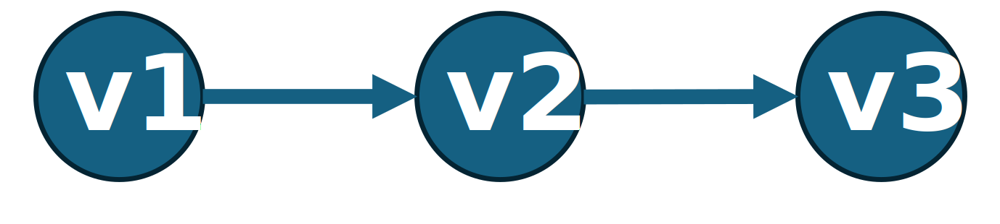
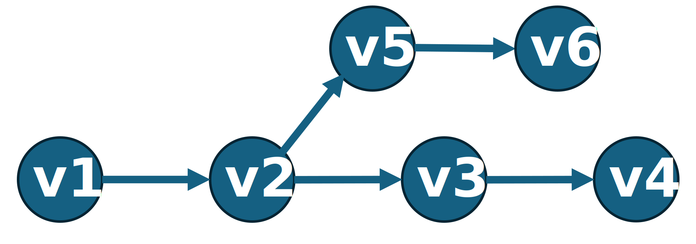
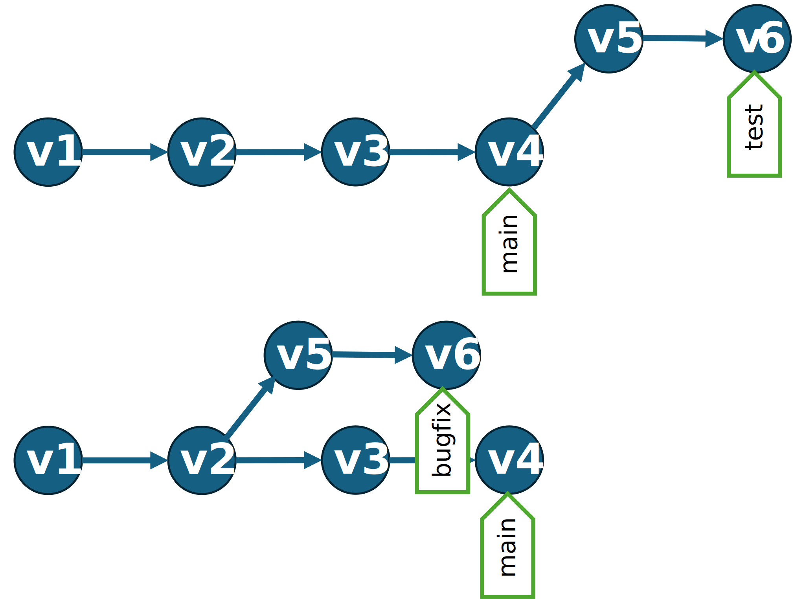

# Git as a Story
### A Version Control Journey for Everyone

---

## 🧭 Why Version Control Matters

You already use version control informally:
- `report_final_v3_reallyfinal.xlsx`
- Multiple presentation drafts
- Document copies "just in case"

**Sound familiar?**

---

## The Questions We Ask

When someone hands you a file, you want to know:
- **Who** made this?
- **Where** did the data come from?
- **Why** did they make these changes?
- **How** did it change over time?
- Does it have the **latest** updates?

---

## What You Really Want

Like a lab notebook for your work:
- **Undo** mistakes
- **Go back in time** to see what changed
- **Audit trail** of edits
- **See which experiments** were run
- **Understand** what worked before

**Git was designed to serve this need.**

---

## Building from Scratch
Let's design this system together.

**Simple approach:** Make a copy every time we like our work
- `report_v1` → `report_v2` → `report_v3`

Works ok for single files. But what about projects?  
`report_v1` also depends on other files (images, spreadsheet, charts, other code files)
* It can get unmanageable quickly

---

## Building from Scratch

**Option 2:**  
Google Docs and Office 365 save automatically...

**But what if:**
- You step away mid-edit
- The snapshot catches a broken state
- You didn't mean to save yet

---

## The Best of Both Worlds

**Option 3:**  
Let's create a **COMMIT BUTTON** that:
- Takes a snapshot when **you** decide
- Saves the **entire folder**, not just one file
- Lets you add a **message** describing the change
- Doesn't create file explosion (`v1`, `v2`, `v3`...)

**Why save the whole folder?**
Otherwise: `report_v20` + `spreadsheet_v3` + `image_v6` = chaos!

---

## 📸 Commit: Your Time Machine Control

Click COMMIT to:
1. Save a snapshot of your work
2. Write a message: "What changed and why?"
3. Create a known good state

Now you have a reliable history to fall back on.



---

## 2. Going Backwards and Forwards

If every commit has a message describing what changed...

**We need a LOG BUTTON** to see the list of changes over time.

**We need a CHECKOUT BUTTON** to jump to any point in history.


---

## The Bookshelf Analogy

Every commit is like a book on a shelf:
- Each book is a complete snapshot of your work at that moment
- Want to see how things looked last month? Pick up that book
- **Checkout** = checking out a book from the library


---

## 3. The Problem with Linear History

Real work isn't linear:
- Scientists test multiple hypotheses
- Analysts try different formulas
- Writers explore alternate endings

**You need to experiment without breaking what works.**

---

## Real Example 1: The Dashboard Analyst

You're building a biomedical research dashboard:
- You have a **better formula** to try
- Want to **test it** without switching everyone
- Can't **stop working** while people test
- Still need the **current version** running

**We need a way to do work without affecting the main.**


---

## Real Example 2: The Emergency Bug Fix

Your live dashboard has a bug:
- Need to **fix it now**
- But you have **unfinished work** in progress
- Can't release half-done features

**Solution: Branch from the released version, fix it there.**



---

## 🌳 Introducing: BRANCHES

The **BRANCH BUTTON** lets you:
- Split off from main history
- Work on experiments safely
- Keep the main version stable
- Track the "tip" (latest commit) of each branch


---

## Branch Visualization

Each branch explores a different direction.
Every commit still traces back to the beginning.



---

## 6. 🏷️ Tags: Milestones and Signposts

Sometimes you need to mark special versions:
- `v1.0` - First release
- `publication-draft` - Submitted to journal
- `final-report-2024` - Year-end version

**TAG BUTTON**: Label any commit for easy reference.

---

## Quick Review: Your Personal Time Machine

So far, we've built a system for **individual work**:

- **COMMIT** - Save snapshots with messages
- **LOG** - See the history of changes
- **CHECKOUT** - Jump to any point in time
- **BRANCH** - Experiment without breaking things
- **TAG** - Mark important milestones

**You can now work safely, experiment freely, and never lose your work.**

---

## 7. Distributed Collaboration

Code (and analysis) is rarely done alone.

**The problem:**
- Can't have people overwriting each other
- Need coordination without chaos

---

## The Solution: Everyone Gets a Copy

The **CLONE/FORK BUTTON** gives someone:
- The entire history
- All the branches
- Full ability to work independently
- No interference with your work

They have their own time machine!

---

## 8. 🔒 Hashes and Identity

**New concern:** What if someone edits the history?
- Sneaks in malicious changes
- Accidentally breaks something

**Solution:** Digital signatures (hashes)

---

## How Hashes Work

Every commit gets a unique fingerprint:
```
24b9da6552252987aa493b52f8696cd6d3b00393
```

- Changes even with tiny edits
- Each commit includes the previous commit's hash
- **Any past change changes all future hashes**
- Makes tampering immediately obvious

---

## 9. Merges: Bringing Work Together

Now we have:
- ✓ Snapshots (commits)
- ✓ Independent work (branches)
- ✓ Complete history (log)
- ✓ Easy comparison (hashes)

**How do we combine our work?**

---

## The MERGE BUTTON

Merging combines branches:
1. Find the most recent **common commit**
2. Combine the **differences** from both branches
3. Create a new commit with combined work


---

## 11. The Staging Area

**Problem:** Sometimes you make a bunch of unrelated edits.

**Best practice:** Package related changes together in one commit.

**Challenge:** What if you forgot to commit before making other changes?

---

## 11. The Staging Area

**Problem:** Sometimes you make a bunch of unrelated edits.

**Best practice:** Package related changes together in one commit.

**Challenge:** What if you forgot to commit before making other changes?

---

## The ADD BUTTON

The **staging area** is like a shopping cart:
- **ADD** changes you want in the next commit
- Leave out changes that belong elsewhere
- **COMMIT** when your cart is ready

**Workflow:** Edit → Add → Commit

---

## The Three States Visualized

```
Working Directory  →  Staging Area  →  Repository
   (modified)          (staged)        (committed)
   
      📝      →   ADD   →   🛒   →   COMMIT   →   📚
```

---

## 14. Wrap-Up: Git as a Cognitive Model

Git isn't just a tool—it's a **way of thinking** about work:
- Work as **structured history**
- Changes as **navigable snapshots**
- Experiments as **parallel explorations**

---

## Three Key Metaphors

1. **📸 Snapshots** – Freeze moments in time
2. **🌳 Branches** – Explore ideas in parallel
3. **🤝 Merges** – Bring ideas together coherently by comparing *differences*

---

## Review: The Story So Far

**The Journey:**
1. Started with messy file copies (`report_final_v3.xlsx`)
2. Built a system to take snapshots (**commit**)
3. Added ability to view history (**log**) and time travel (**checkout**)
4. Created parallel timelines for experiments (**branch**)
5. Marked important moments (**tag**)
6. Enabled collaboration by sharing complete copies (**clone/fork**)
7. Protected integrity with digital signatures (**hashes**)
8. Combined work from different branches (**merge**)
9. Organized changes before saving (**staging/add**)

---

## The Buttons We've Created

- **COMMIT** - Save a snapshot
- **LOG** - View history
- **CHECKOUT** - Jump in time
- **BRANCH** - Split off to experiment
- **TAG** - Mark milestones
- **CLONE/FORK** - Share the entire history
- **MERGE** - Combine work
- **ADD** - Stage changes

---

## You Now Understand Git

Everything else is just:
- Syntax and commands
- Tools and interfaces
- Best practices and workflows

**The concepts? You've got them.**

---

# Questions?

```
$ git commit -m "Learning complete"
```

---

# Thank You

**Remember:** Version control is about telling the story of your work.

Git just gives you the tools to tell it well.