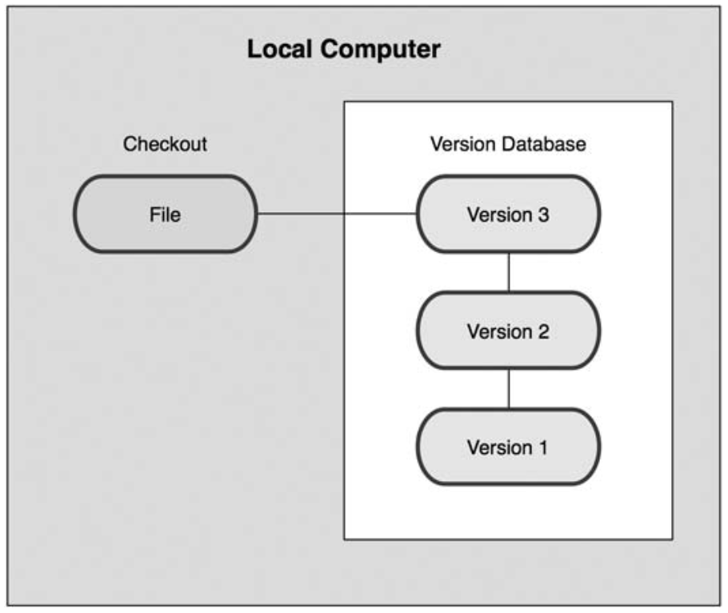
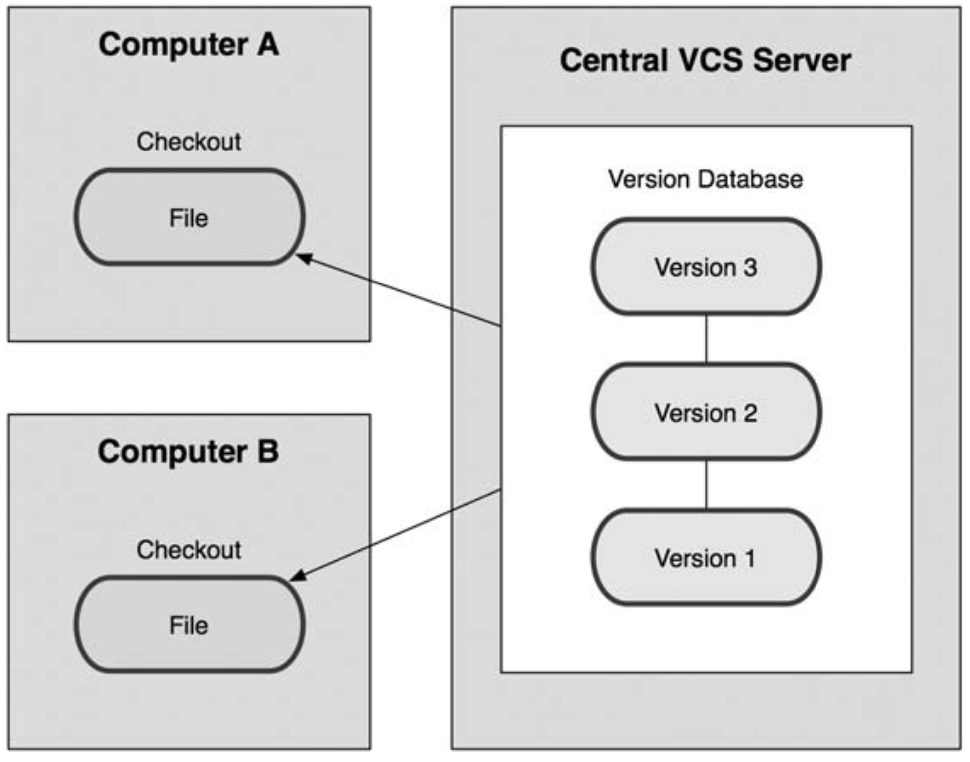
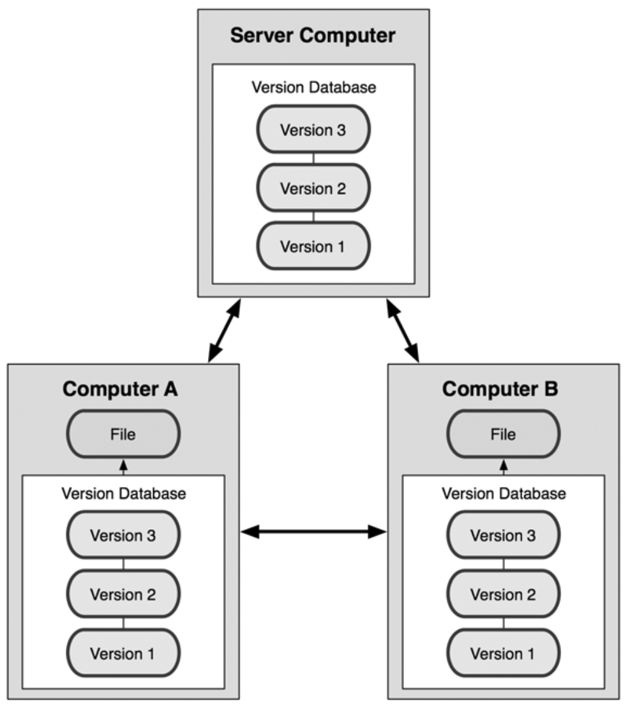
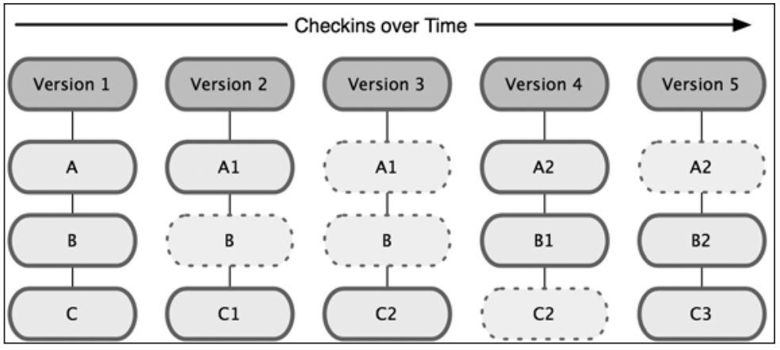

# Version Control and GitHub

```
$ echo "Data Sciences Institute"
```

---
Prerequisites:
- GitHub account

---
Key Texts:
- Chacon and Straub, 2014, Pro Git, 2nd Edition.
- Timbers, Campbell, Lee, 2021, Data Science: A First Introduction, https://ubc-dsci.github.io/introduction-to-datascience/

---
References
- Chacon and Straub: Chapter 1
- Timbers: Chapter 12.3 - 12.4, 13.3.1

---


## `Version Control`

---
##### What is Version Control?
Version control is a system that records changes to a file or a set of files over time so that we can recall a specific version later. We may already do this by copying files to another directory to save past versions.While it is simple, it lacks flexibility and complexity.

---
Version Control Systems (VCS) can do a number of things and can be applied on nearly any type of file on our computers:
- revert files to a previous state
- revert entire project to a previous state
- compare changes over time
- see who modified something last
- who introduced an issue and when
- recover lost files

---
##### Local Version Control Systems
Local VCSs were developed to keep track of changes to our files by putting them in a version database.



---
##### Centralized Version Control Systems
Centralized VCSs (CVCS) were developed to enable collaboration with developers on other systems. CVCSs have a single server that contains all the versioned files.



---
CVCSs allow some level of transparency to others' work and give Administrators a level of control over what developers can and can't do.

Unfortunately, a single server means that if it ever goes down, all collaboration halts for however long that lasts for. Additionally, if backups haven't been kept, work could easily be lost.

---
##### Distributed Version Control Systems
To handle the limitations of LVCSs and CVCSs, Distributed VCSs were created. This includes Git, Mercurial and Bazaar. 

Collaborators mirror the entire repsoitory, therefore if a server dies, any one of the collaborators' repositories can be copied back to the server to restore it.

---


---


Questions?

---


## `Git`

---
##### Git Basics
Git thinks of data in a very different way than other VCSs. Instead of storing a set of files and the changes over time, Git thinks of its data more like a set of snapshots of a mini file system. 

If files have not changed, Git does not store the file again, it links to the previous identical file already stored.

---


---
##### Local Operations
Most operations on Git only need local files and resources to operate. Git also keeps the entire history of our projects on our local disks meaning we can see changes made months ago without a remote server.

We also don't need to be connected to the server to get work done, rather we only need to be connected when we want to upload our work.

---
##### Benefits
Git uses a check-summing mechanism called *SHA-1 hash* which is calculated based on the contents of a file or directory structure in Git. It looks somehting like this:
```
24b9da6552252987aa493b52f8696cd6d3b00393
```
This checksum means it's impossible to change the contents of any file or directory without Git knowing about it.

Git generally only adds data, making it fairly difficult to lose data once we've committed, which we'll learn about later.

---
##### The Three States
There are three main states that our files can reside in:
- Committed:
    - data is safely stored on local database
- Modified:
    - file has been changed but not yet committed
- Staged:
    - modified file has been marked to go into the next commit

---
##### The Three Main Sections
There are three main sections to a Git project:
- The Git directory
- The working directory
- The staging area

---
##### The Git Directory
The Git directory is where Git stores the metadata and object database for our projects. It is what is copied when we clone a repository from another computer.

---
##### The Working Directory
The working directory is a single checkout of one version of our projects. These files are pulled out of the compressed database in the Git directory and placed on the disk for us to modify.

---
##### The Staging Area
The staging area is a simple file that stores information about what will go into our next commit.

---
##### Workflow
A basic workflow will look something like this:
1. Modify files in our working directory
2. Stage the files in the staging area
3. Commit the changes which takes the files from the staging area and stores them on the Git directory.

---


Questions?
