# Git Basics
```
$ echo "Data Sciences Institute"
```

---

References
- Chacon and Straub: Chapter 2

---


## `$ git init` / `$git clone`

---
##### Respositories in an Existing Directory
We're quickly getting into how to start our first Git repository, or commonly known as repo. First we'll learn how to import an existing repo into Git:
```console
$ git init
```
```console
$ git init -b main
```
Here we're creating a new subdirectory named `.git` that will contain all our necessary repo files. The option `-b` will create a new branch called main.

---
##### Cloning an Existing Respository
If we want to collaborate on an existing repo, we need to clone the repo from GitHub. If we don't have a project set up yet, we'll need to do that first.

---
1. Create a new project
<br>

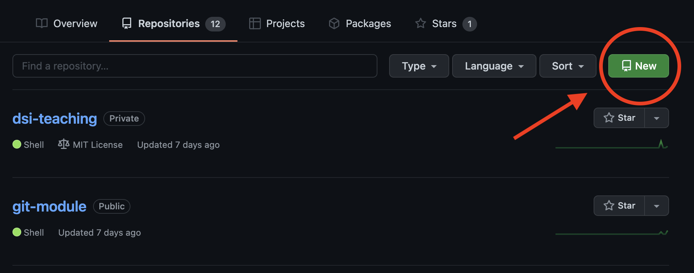

---
2. Add name and optional description
<br>

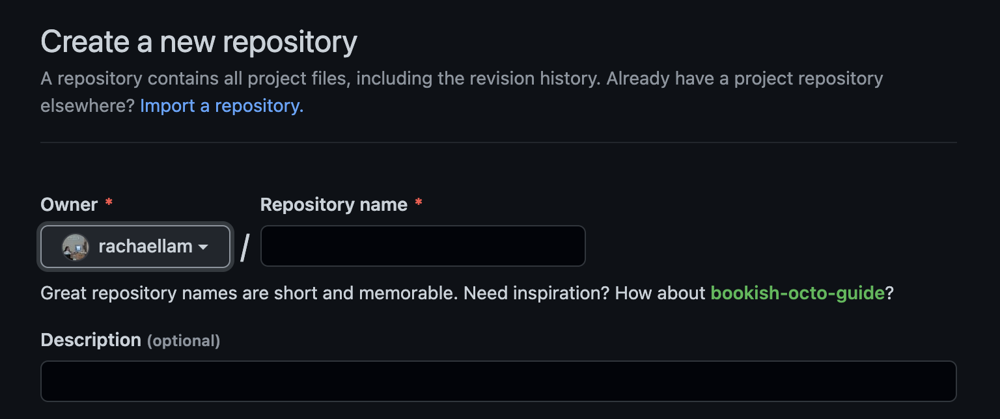

---
3. Choose public or private and add initialize
<br>

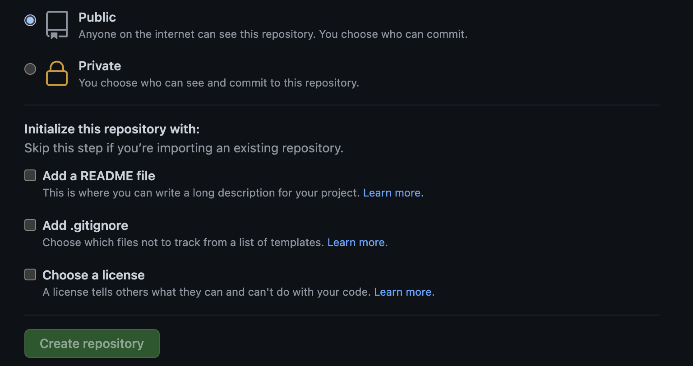

---
There are a number of automatically generated files such as log files that we might not want Git to add or show as untracked. We can create a file called `.gitignore` to ignore the automatically generated files. 

The `.gitignore` is dependent on the type of coding language you are using but can also be modified to fit specific purposes.

---
If we created a repo on GitHub, we can choose a `.gitignore` template. We can select a template specific to the coding language we are using.

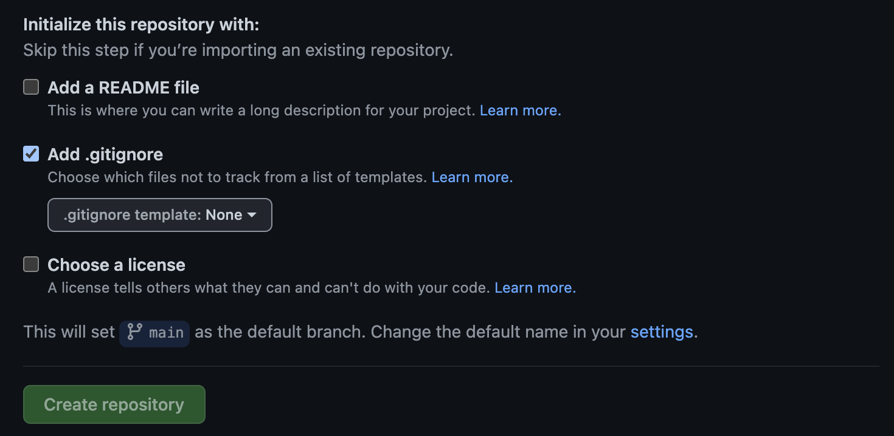

---
Once we have our repo, we can clone it:
```console
$ git clone https://github.com/rachaellam/git-module.git
```
Using this code, we've created a repo called `git-module` (by taking the last part of the link) and initialized a `.git` directory and pulled all data for that repository while checking for the latest copy.

---
The url used in the previous code block is copied directly from GitHub by clicking code and copying the HTTPS:

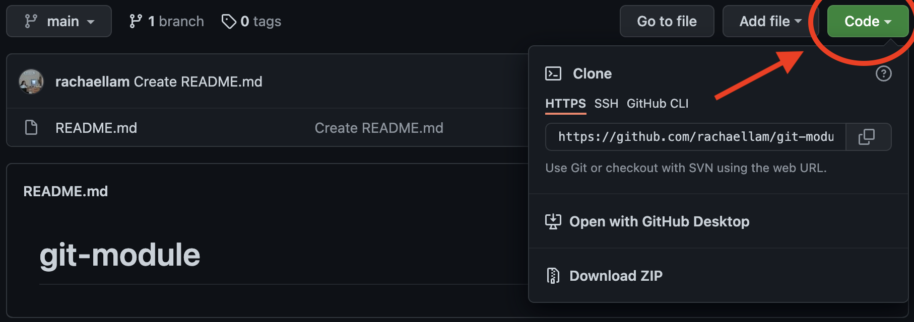

---
If we want to change the name of the repo, we can specify that as the next command line option:
```console
$ git clone https://github.com/rachaellam/git-module.git mymodule
```

---


Questions?

---

# Git Commands

---
References
- Chacon and Straub: Chapter 2
- Timbers: Chapter 12.5

---


## `$ git status`

---
##### Tracked and Untracked Files
Files in our working directory can either be tracked or untracked. Tracked files are files that that were in the last snapshot and can be unmodified, modified or staged. Untracked files are files that aren't in our last snapshot or staging area.

When we modify a file, Git keeps track of the modifications even before we've decided to commit. We can then stage the modifications and then commit.

---
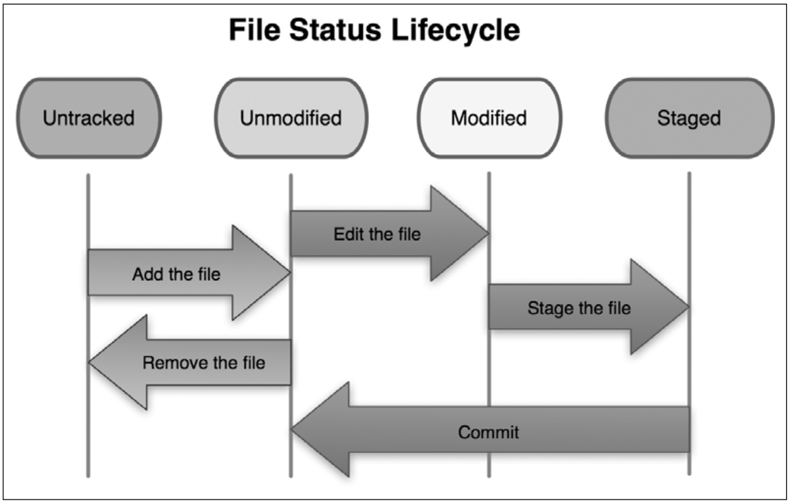

---
##### File Status
To better understand what state our files are in, we can check the status:
```console
$ git status
```
If we've just created our repo, we should see (or something similar):
```console
# On branch main
# Your branch is up to date with 'origin/main'.

# nothing to commit, working tree clean
```

---
Let's now add a README.md file, because every good repo has a good README.

```console
$ touch README.md
```

And see the status:

```console
$ git status
```

---
```console
On branch main

No commits yet

Untracked files:
  (use "git add <file>..." to include in what will be committed)
	README.md
```
Here we can see that we still haven't committed anything and that we have an untracked README.md file. Git also gives us a bit of information including how to add a file to track.

---


## `$ git add`

---
##### Tracking New Files
To track new files, or stage new files, we can use `git add` along with the file that we want to track:
```console
$ git add README.md
```
We can run `git status` again to see the results of `git add`. 

---
```console
On branch main

No commits yet

Changes to be committed:
  (use "git rm --cached <file>..." to unstage)
	new file:   README.md
```
Now we can see that our README.md file is staged to be committed. 

---
Let's say we add some more info to our README.md file, which has now been tracked. If we run `git status`, we can know:
```console
On branch main

No commits yet

Changes to be committed:
  (use "git rm --cached <file>..." to unstage)
	new file:   README.md

Changes not staged for commit:
  (use "git add <file>..." to update what will be committed)
  (use "git restore <file>..." to discard changes in working directory)
	modified:   README.md

```

---
We can stage our additional changes and check the status:
```console
$ git add README.md
$ git status
```
```console
On branch main

No commits yet

Changes to be committed:
  (use "git rm --cached <file>..." to unstage)
	new file:   README.md

```

---
Let's try adding another file into our directory. It can be something that you've been working on independently, or we can add our project from the previous Unix module.

---
If we modify many things at once, we can add the option `-A` to add all files, rather than adding one by one
```console
$ git add -A
```
A little note about this: it's best to upload your work in small chunks for readability and for collaboration. So if you have a bunch of files, it's recommended to split them into smaller chunks.

---


Questions?

---


## `$ git commit`

---
Once we've staged your selected files, it's time to commit the changes. Anything that wasn't staged (any modifications since `git add`) will not be included in the commit.

`git commit` is most easily run with the option `-m`. This adds a message to your commit

```console
$ git commit -m "adding a message here"
```

---
##### -m
Messages should be clear. They can also be extremely detailed if needed. By not including the option `-m`, Git will provide the latest output of `git status`. If you want even more information, you can use the option `-v`.

---
Messages are extremely important for our own records and also when collaborating with others. They can act as a reminder for what our commit includes, and also tell our collaborators what we did last.

It's important to commit often as well so that merges are easier to locate and fix. 

It's also helpful if you want to go back to an earlier version. You have more options to choose from.

---
Practices around messages can vary but if we want to add a longer message we can remove the `-m` option.
```console
$ git commit
```
Then hit `i` to add a message. You'll see `-- INSERT --` at the bottom and you can begin typing your message. 

When finished, press `esc` then `:wq` or `:x`.

`w` means write and `q` means quit. `x` is shorthand for `wq`

---
```
Short (50 chars or less) summary of changes

More detailed explanatory text, if necessary. Wrap it to about
72 characters or so. In some contexts, the first line is treated 
as the subject of an email and the rest of the text as the body, 
the blank line separating thesummary from the body is critical 
(unless you omit the body entirely).

Further paragraphs come after blank lines.

- Bullet points are okay, too

- Typically a hyphen or asterisk is used for the bullet, preceded
  by a single space with blank lines in between, but conventions
  vary here
```

---


## `$ git remote`

---
Remote repos are versions of our projects that are hosted on the internet or some network. This allows us to collaborate with others outside of our local repo.

We can see the remote servers we've configured using `git remote`. If we add the option `-v`, we can see the URL:
```console
$ git remote -v
```
Cloned repos will be displayed as origin by default. 

---
##### Remote Setup
Before we connect our local repo to a remote repo, we need to setup our permissions. This is so we can send and retrieve work to and from our remote repositories. There are two ways to do this:

1. Access Tokens

---
##### Access Tokens

&nbsp;&nbsp;&nbsp;&nbsp;&nbsp;&nbsp;&nbsp;&nbsp;&nbsp;&nbsp;&nbsp;&nbsp;&nbsp;&nbsp;&nbsp;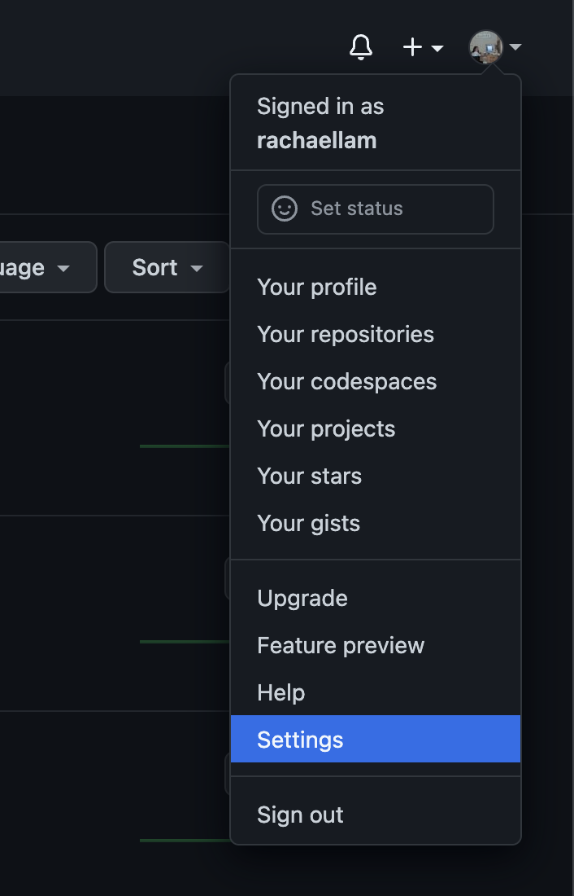 &nbsp;&nbsp;&nbsp;&nbsp;&nbsp;&nbsp;&nbsp;&nbsp;&nbsp;&nbsp;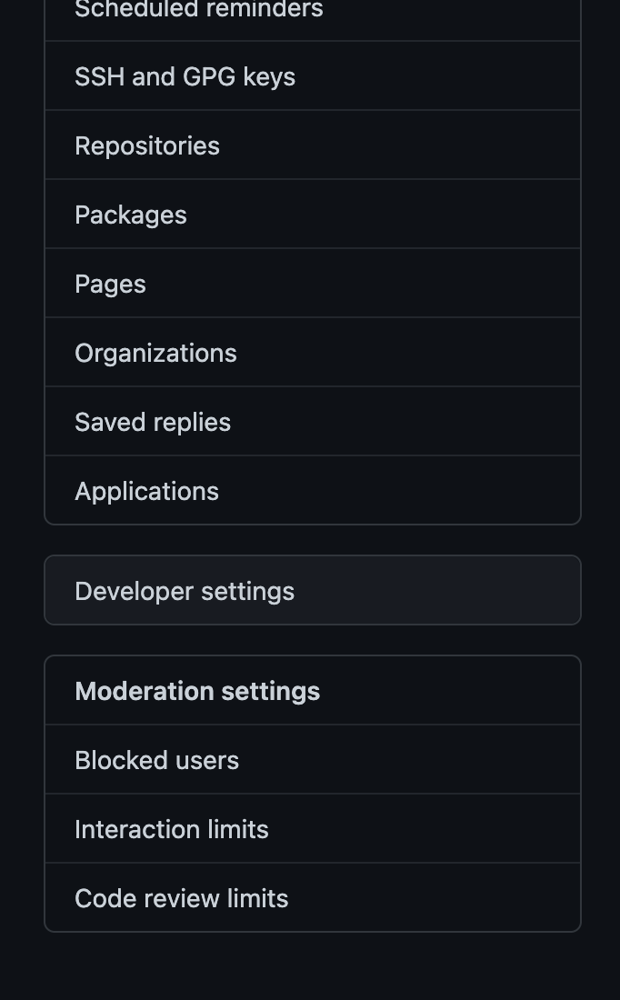

---
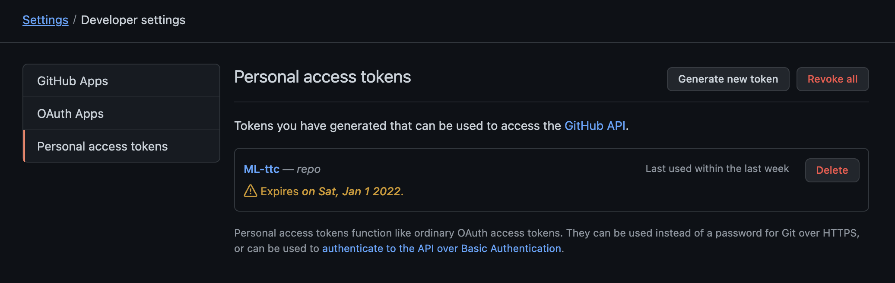

---
##### remote add
To add a remote repo, we can use `git remote add` followed by the name and URL. Now we can connect our local repo to a remote repo:
```console
$ git remote add origin https://github.com/rachaellam/git-r.git
$ git remote -v
```
After checking we'll see:
```console
origin  https://github.com/rachaellam/git-r.git (fetch)
origin  https://github.com/rachaellam/git-r.git (push)
```

---
If we want to see more information about a remote repo, we can use the command:
```console
$ git remote show origin
```
Here we can see the URL that we're fetching and pulling from, our remote branches, and configurations for git push (to the main branch or another).

---
To send and retrieve work between our local and remote repositories, we have to authenticate a personal access token:

&nbsp;&nbsp;&nbsp;&nbsp;&nbsp;&nbsp;&nbsp;&nbsp;&nbsp;&nbsp;&nbsp;&nbsp;&nbsp;&nbsp;&nbsp; &nbsp;&nbsp;&nbsp;&nbsp;&nbsp;&nbsp;&nbsp;&nbsp;&nbsp;&nbsp;

---


---


Questions?

---


## `$ git fetch` / `$ git push` 

---
When collaborating with others, changes might be made that are important to copy to your local directory. `git fetch` will get any new changes but it won't merge it to our work or modify our work.
```console
$ git fetch origin
```

---
`git pull` will automatically fetch and merge a remote branch to our current branch (more on branching later). It's a good practice to pull before every work session, especially when working with others. Otherwise, a collaborator might have made changes, and you won't be able to push your changes to GitHub.
```console
$ git pull
```

---
If we've create our remote repository using `init` and `remote add`, we need to specify the remote that we want to pull to and the branch we want to pull from.
```console
$ git pull origin main
```
`origin` being the name of the remote repo we created earlier and `main` being the main branch on our GitHub repo.

---


Questions?

---


## `$ git push`

---
When we're ready to share our modifications, we have to push our project and files upstream using `git push`
```console
$ git push origin main
```
Here we're pushing to our origin server on your main branch. The main branch is sometimes called the master branch.

This command only works if we have write access and if no collaborator is pushing upstream at the same time as we are. We'd have to instead pull and merge their work before pushing our own.

---


Questions?

---

# Git Branching

---
References
- Chacon and Straub: Chapter 3
- Timbers: Chapter 12.8

---
Branching allows us to diverge from the main line to do work without accidentally messing with the main line. This helps with testing without making any accidental changes to the working branch.

To understand how branching works, let's go back and understand how Git saves files.
- blob
- tree
- pointer

---
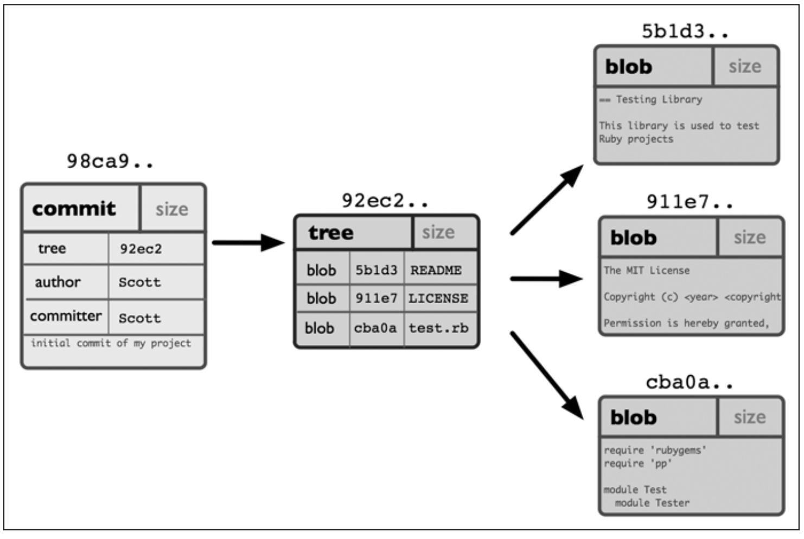

---
A branch is a way to move different pointers to a specific commit. In Git, the default branch is named *master* or *main*. When we first start making commits, we start at the master branch that automatically points to the last commit made.

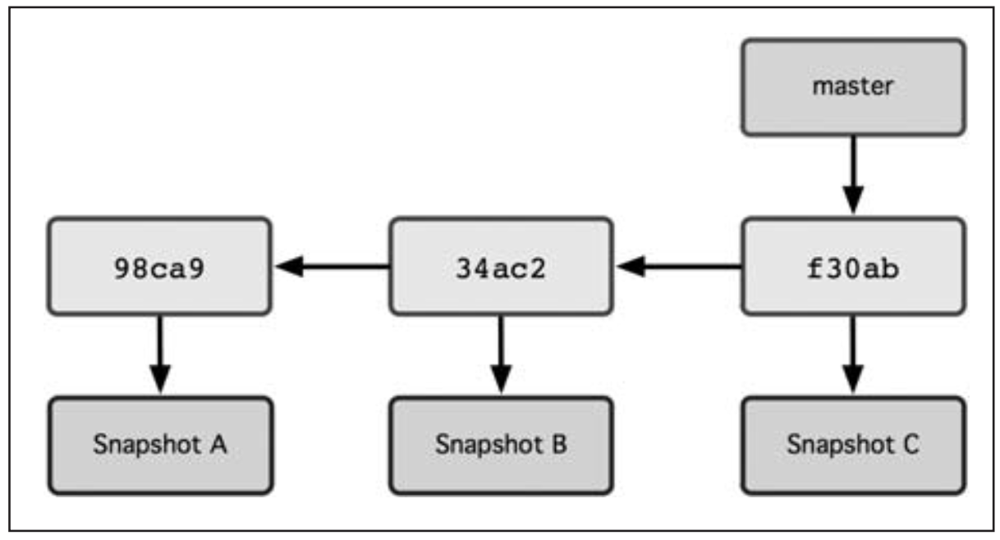

---


## `$ git branch`

---
We can make a new branch which creates a new pointer for us to move around. We can do this by using the command `git branch`:
```console
$ git branch testing
```

---
Here, we've created a branch called testing, which means we've created a new pointer that could point to our current commit.

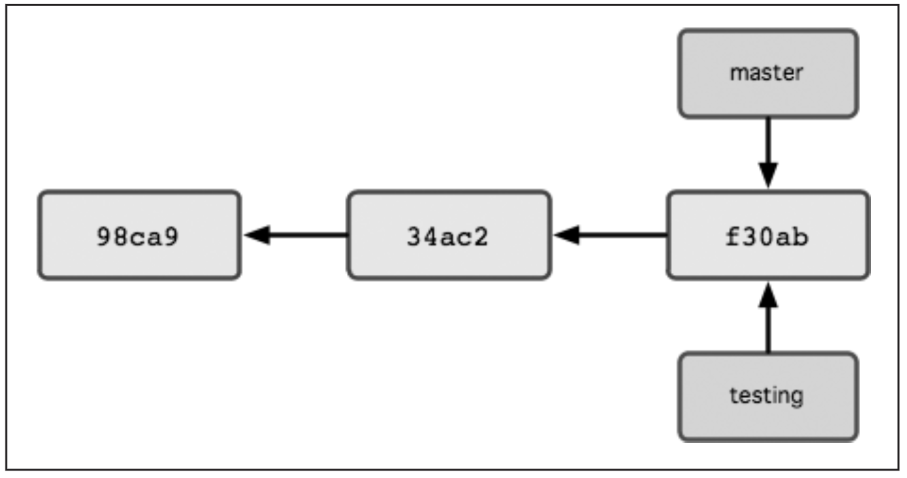

---


## `$ git checkout`

---
Git tracks what branch we're on using a pointer called `HEAD`. If we move the `HEAD` to the branch *main*, we'll see:
```console
Already on 'main'
```
To move `HEAD` to point to the testing branch that we just created, we use `git checkout`:
```console
$ git checkout testing
```
and we should see..
```console
Switched to branch 'testing'
```

---
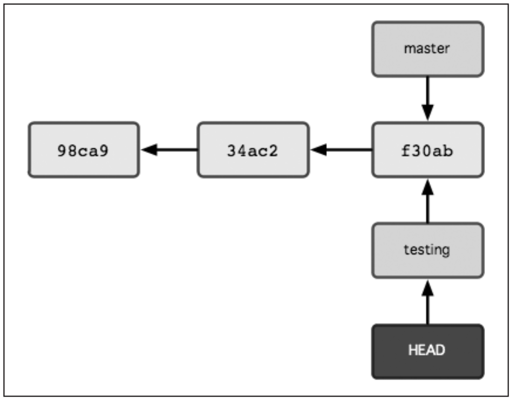

---
If we make some changes to our testing branch and commit, our head will move with the new commit.

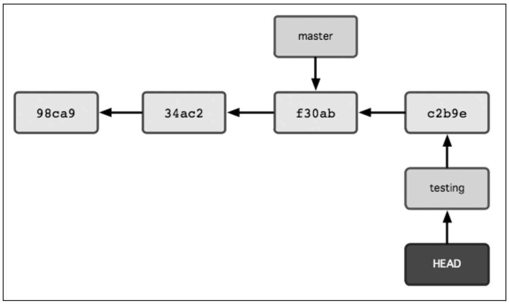

---
If we want to go back to an older version of our project and make changes, we can use `git checkout` again to redirect the head back to our master branch:
```console
$ git checkout main
```
Using this command will move the `HEAD` pointer back to our master branch and revert our files in our working directory back to the snapshot that the master branch points to.

---


Questions?

---


## `Branching`

---
Let's take a look at a workflow that you might encounter:
```console
$ git commit -m "commits to master branch"
```
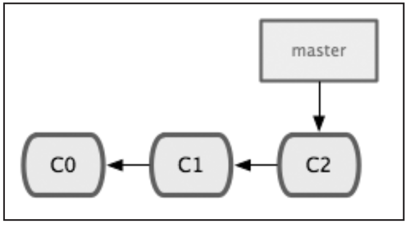 

---
```console
$ git checkout -b iss53
```
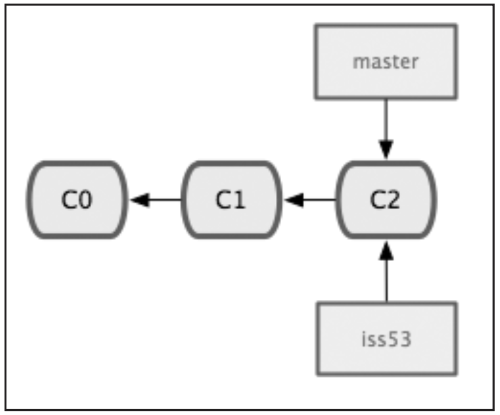

---
```console
$ git commit -a -m "commits to iss53"
```
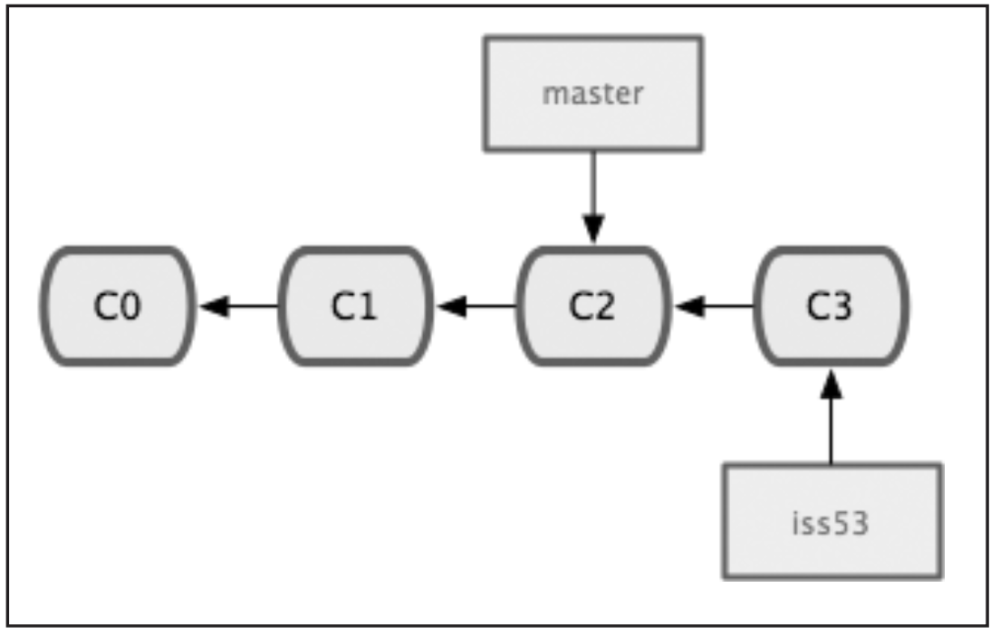

---
```console
$ git checkout master
$ git checkout -b 'hotfix'
$ git commit -m "commits to hotfix"
```
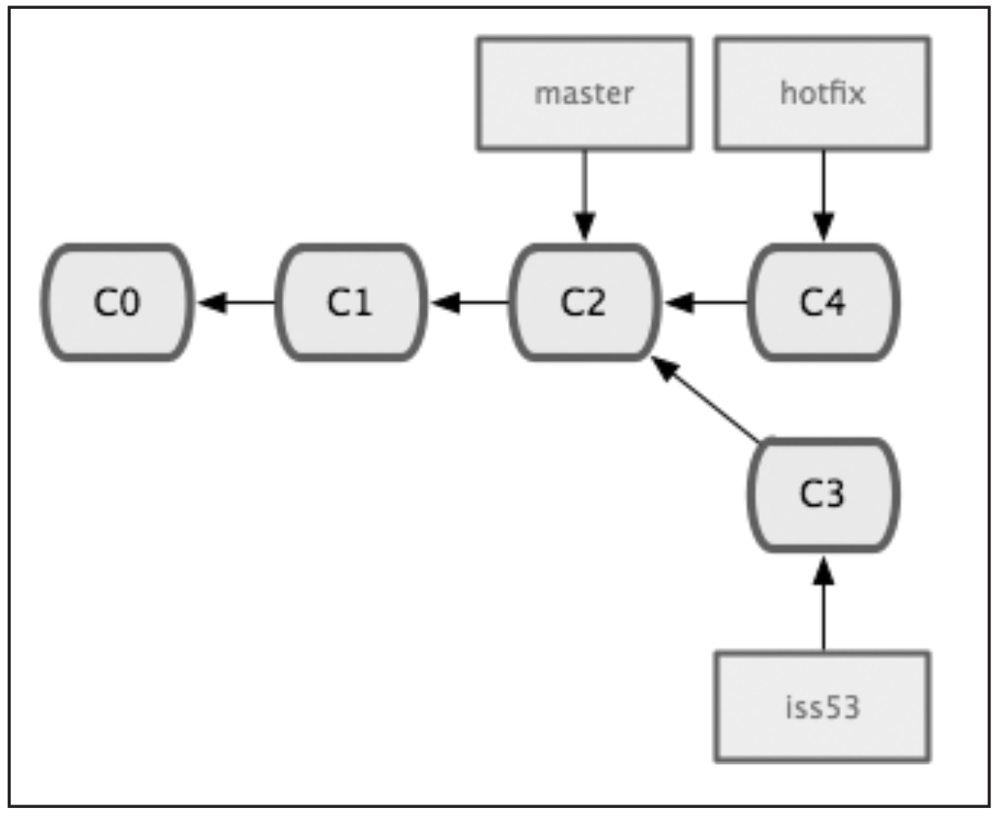

---
```console
$ git checkout master
$ git merge hotfix
```
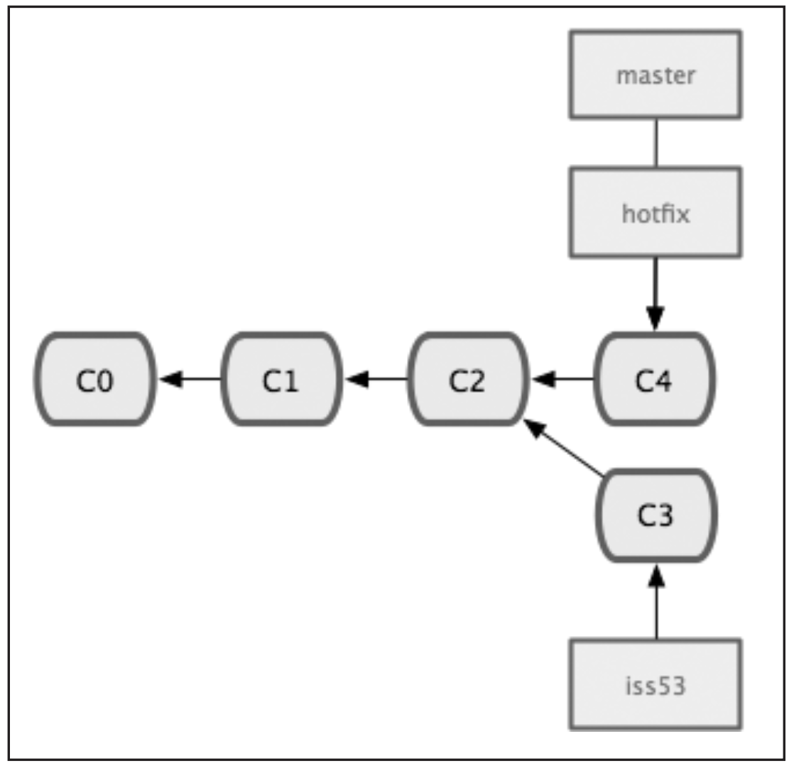

---
##### Pushing
When we're ready to share our work, we'll use `git push`. If the remote branch already exists, we can push directly to that branch:
```console
$ git checkout testing
$ git add -A
$ git commit -m "testing branch commit"
$ git push origin testing
```
This will push our changes to the existing testing branch on GitHub.

---
If we were working with a branch that only exists locally, we can push it to GitHub with a slight tweak:
```console
$ git checkout new-branch
$ git add -A
$ git commit -m "new branch commit"
$ git push origin main:new-branch
```
This will create a new branch on GitHub called `new-branch`. From here, if we want to continue updating this branch, we can just run `git push origin new-branch`.
Then we'll create a branch that exists on our local drive:
```console
git checkout -b testing origin/testing
```
Here we're pointing the `HEAD` to the new branch (`-b`) called `testing` from `origin/testing`
