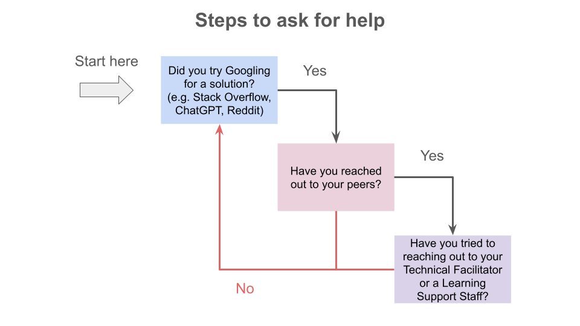

# Git and GitHub

## Contents
* [Description](#description)
* [Learning Outcomes](#learning-outcomes)
* [Assignments](#assignments)
* [Contacts](#contacts)
* [Delivery of the Learning Module](#delivery-of-the-learning-module)
* [Schedule](#schedule)
* [Requirements](#requirements)
* [Resources](#resources)
  + [Cheat sheet](#cheatsheet)
  + [Videos](#videos)
  + [How to get help](#how-to-get-help)
* [Folder Structure](#folder-structure)

## Description

This module is focused on version control with Git and GitHub, and how it connects to the ethical discussions of reproducibility. Learners will set up Git and create and use repositories, including recording, viewing and undoing changes. They will also learn how to create branches and collaborate with others with shared branches. This module will also introduce some more advanced commands such as de-bugging and history editing.

Throughout the entire module, Learners will learn how to problem-solve through live coding. They will also learn about reproducibility and how to center it within their work.

## Learning Outcomes

By the end of the module, participants will be able to:
* Use Git to collaboratively save, restore, and update work through version control
* Explain the difference between Git and GitHub

## Assignments

Participants should review the [Assignment Submission Guide](https://github.com/UofT-DSI/onboarding/blob/main/onboarding_documents/submissions.md) for instructions on how to complete assignments in this module.

1. [Git Assignment](https://github.com/UofT-DSI/git/blob/main/02_assignments/git_assignment.md)

## Contacts

**Questions can be submitted to the _#cohort-3-help_ channel on Slack**

* Technical Facilitator:   
  * **Simeon Wong** (he/him)  
    simeonm.wong@utoronto.ca

* Learning Support Staff: 
  * **Michaela Drouillard** (she/her)  
  michaela.drouillard@mail.utoronto.ca
  * **Julia Gallucci** (she/her)  
  julia.gallucci@mail.utoronto.ca
  * **Emma Teng**  
  e.teng@mail.utoronto.ca
 
##  Delivery of the Learning Module

The module will run synchronously twice a week on Zoom. The first two days are used as "lectures" and will last a maximum of 3 hours. During this time, the Technical Facilitator will introduce the concepts for the week. The last two days are used as optional, asynchronous work periods. The work periods will also last for up to 3 hours. During these two days, a Technical Facilitator or Learning Support will be present on Zoom to assist learners reach the intended learning outcomes.

### How the Technical Facilitator will deliver

The Technical Facilitator will introduce the concepts through a collaborative demonstration along with the use of the slides.
 
Participants are encouraged to engage actively during the learning module. They key to developing the core skills in each learning module is through practice. The more participants engage in coding along with the instructional team, and applying the skills in each module, the more likely it is that these skills will solidify. 

## Schedule

The schedule is tentative and may be modified as needed. Learners will be notified of schedule changes.

||Day 1|Day 2|Day 3|Day 4|Day 5|
|---|---|---|---|---|---|
|Week 1|Lecture 1 ([Shell](https://github.com/UofT-DSI/shell))|Lecture 2 (Shell)|Lecture 3 (Git & GitHub)|Work Period 1|Work Period 2|
 
## Requirements

* Learners are not expected to have any coding experience, we designed the learning content for beginners.
* Learners are encouraged to ask questions and collaborate with others to enhance learning.
* Learners must have a computer and an internet connection to participate in online activities.
* Learners must not use generative AI such as ChatGPT to generate code to complete assignments. It should be used as a supportive tool to seek out answers to questions you may have.
* We expect learners to have completed the [onboarding repo](https://github.com/UofT-DSI/onboarding/tree/main/onboarding_documents).
* Using a webcam is optional although highly encouraged. We understand that not everyone may have the space at home to have the camera on.

## Resources

Feel free to use the following as resources:

### Cheat sheet

- [Atlassian](https://www.atlassian.com/git/tutorials/atlassian-git-cheatsheet)
- [GitHub](https://education.github.com/git-cheat-sheet-education.pdf)

### Videos
- [Most common git commands](https://www.youtube.com/watch?v=PSJ63LULKHA)
- [Git explained in 100 seconds](https://www.youtube.com/watch?v=hwP7WQkmECE)
- [Git vs GitHub: What's the difference?](https://www.youtube.com/watch?v=wpISo9TNjfU)

### How to get help



<hr>

## Folder Structure

```markdown
.
├── 01_slides
├── 02_assignments
├── 03_homework
├── 04_instructional_team
├── LICENSE
├── README.md
└── steps_to_ask_for_help.png
```

* **slides:** Module slides as PDF or PPTX files.
* **homework:** Homework to practice concepts covered in class.
* **assignments:** Assignments.
* **instructors:** This folder guides Technical Facilitators and the Learning Support team on teaching methodologies and content delivery.
* README: This file!
* .gitignore: Files to exclude from this folder, specified by the Technical Facilitator
